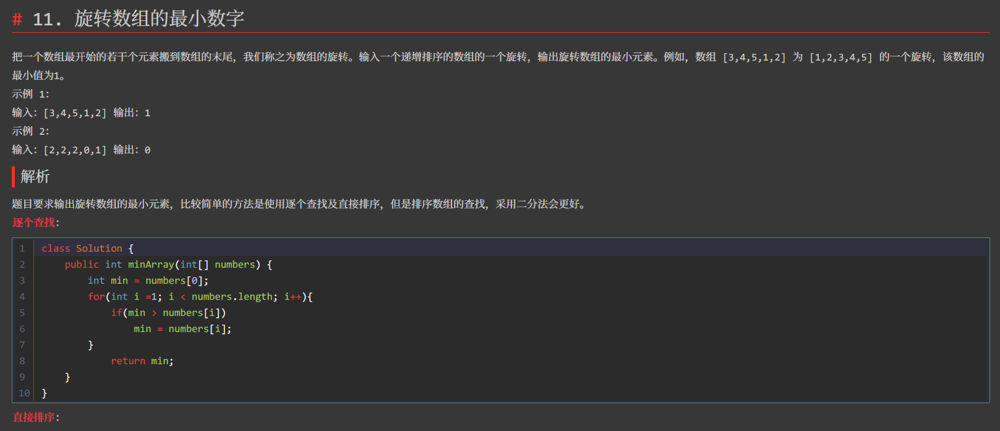

# typora-theme-redrail
> 一个`typora`主题，具有[pie](https://github.com/shrugginG/typora-theme-pie)和[ursine](https://github.com/danielduyixin/typora-theme-ursine)的风格。

[English](./README.md) | 简体中文
## 主题的由来
`redrail`主题来源于少数派风格的主题，在各种typora主题中，少数派风格以令人醒目清爽的红色作为基调，能在代码和笔记过程中令人更加愉悦与轻松。同时，在白天使用浅色主题使笔记清晰明了，夜晚可以使用深色主题令人舒适。以下为几处灵感来源，对此表示感谢。
- [pie](https://github.com/shrugginG/typora-theme-pie)主题
- [ursine](https://github.com/danielduyixin/typora-theme-ursine)主题
- `@张晋`对于pie主题与ursine的修改

如果您喜欢这个主题，请给一个星星点赞，感谢您的关注！
## 特性
- [x]  :baby_chick: 支持暗黑主题
- [x]  :rocket: 浅色主题具有优化的字体颜色，页宽，有序列表和无序列表
- [x]  :sailboat: 暗黑主题对字体颜色，背景颜色，字体粗细，引用块，字体行高，字体间距，代码块字体，行间代码，代码块高亮样式进行了调整，更加协调和舒适
## 安装主题
1. 下载本主题中的`redrail.css`，`redrail-night.css`文件，以及 `redrail`和 `redrail-night` 文件夹，** `redrail`和 `redrail-night` 文件夹不是必须的，这里面仅仅包含了所需的字体**；
2. 打开 Typora，点击“**偏好设置**（`ctrl + ,`）” => “**外观**” => “**打开主题文件夹**”按钮，会弹出 Typora 的主题文件夹；
3. 将下载好的`redrail.css`，`redrail-night.css`文件，以及 `redrail`和 `redrail-night` 文件夹放到 Typora 的主题文件夹中；
4. 关闭并重新打开 Typora，从菜单栏中选择 “**主题**” => “**redrail**”或“**redrail-night**” 即可。

>用户想获得更好的体验，请确保电脑已安装Consolas, 'Source Han SerifCN'字体。

## 效果图

## 更新记录

**2022年3月18日更新**

黑暗主题下：

1. 正文右键属性黑暗模式调整。

2. 侧边栏文件鼠标悬停色问题。

3. 侧边栏文件名背景色不清楚问题。

4. 正文选择文本背景色调整。

**2021年6月9日更新**

浅色主题下：

1. 英文字体由Consolas改为Menlo，其对于代码更为友好，相比Consolas区分度更高，中文字体由思源宋体改为微软雅黑，在低分辨率的屏幕上可以获得更好的体验。

2. 设置源代码模式下的字体颜色。

3. 调整行间代码颜色。

黑暗主题下：

1. 修改英文及中文字体。

2. 修改部分代码框高亮颜色。

3. 修改侧边栏下方操作框颜色。

**2021年4月2日 更新**

1. 修改了浅色和暗色主题代码块左侧间距

2. 调整暗色主题表格颜色。

3. markdown框内调整字体颜色。

4. 删除redrail-night.user.css文件，将其中配置放入redrail-night.css。

5. 修改浅色主题和深色主题公式颜色。

**2021年3月31日 创建**
